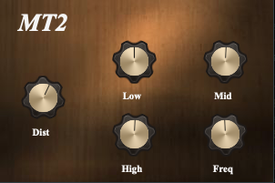

= MT2 1.0.0
Matthieu Brucher <matthieu.brucher@gmail.com>
:doctype: book
:source-highlighter: coderay
:listing-caption: Listing
// Uncomment next line to set page size (default is Letter)
//:pdf-page-size: A4

*MT2* is a free Open Source plugin emulating the MT2 pedal.

== Usage

Here is how the parameters interact with the plugin:

[square]

== Bugs

There shouldn’t be bugs, but you never know. Please contact me or leave a message on http://www.audio-tk.com[Audio ToolKit web site] or on http://blog.audio-tk.com/tags/mt2/[my blog, on the announcement page].
