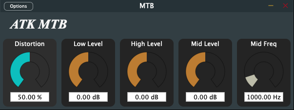

= MTB 1.0
Matthieu Brucher <matthieu.brucher@gmail.com>
:doctype: book
:source-highlighter: coderay
:listing-caption: Listing
// Uncomment next line to set page size (default is Letter)
//:pdf-page-size: A4

*MTB* is a free Open Source plugin Adapting the MT2 pedal for the bass guitar.

== Usage

Here is how the parameters interact with the plugin:

[square]
* *Distortion* is the distortion level your want
* *Low level* is the amount of low frequency content
* *High level* is the amount of high frequency content
* *Mid level* is the amount of mid frequency content
* *Mid frequency* is the central frequency content

There are a few advanced parameters that are not available on a regular MTB pedal and thus are not accessible through the UI:

[square]
* *Low Q* changes the Q parameter of the low-tone bell filter
* *High Q* changes the Q parameter of the high-tone shelf filter
* *Mid Q* changes the Q parameter of the mid-tone bell filter

== Bugs

There shouldn’t be bugs, but you never know. Please contact me or leave a message on http://www.audio-tk.com[Audio ToolKit web site] or on http://blog.audio-tk.com/tags/mtb/[my blog, on the announcement page].
